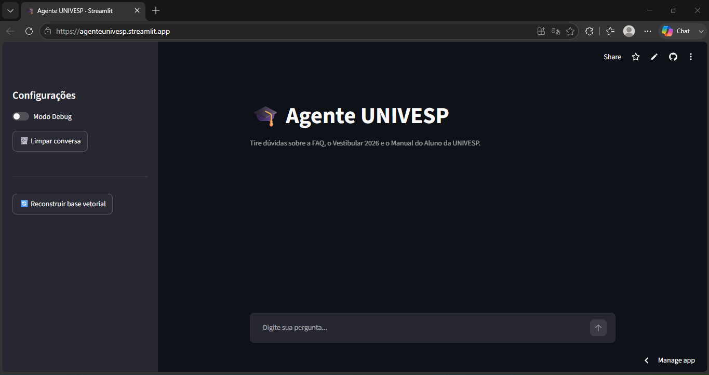
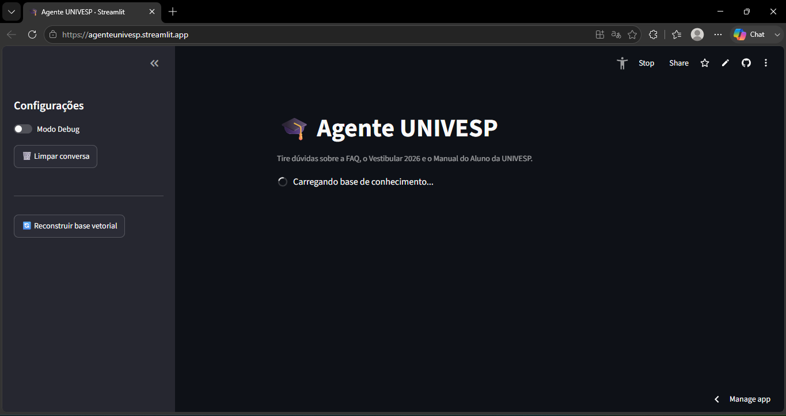
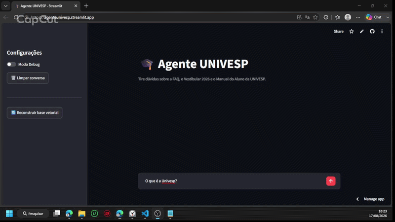
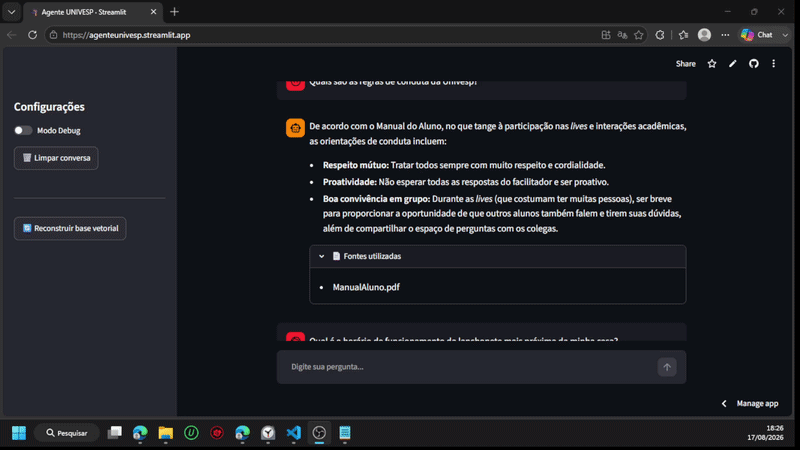
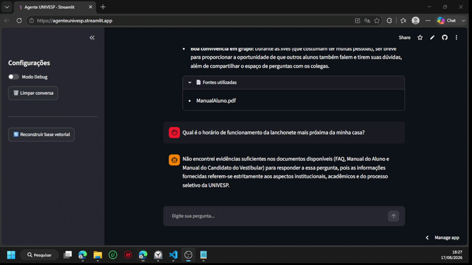

# 🎓 Agente RAG UNIVESP

> Chatbot conversacional que responde dúvidas sobre a UNIVESP com base exclusivamente em documentos oficiais, usando arquitetura RAG (Retrieval-Augmented Generation).

Projeto desenvolvido como desafio técnico da trilha **Tech AI Builder**, na segunda fase do programa **Oracle Next Education (ONE)**. O agente combina Google Gemini, LangChain e ChromaDB para responder perguntas sobre a UNIVESP (Universidade Virtual do Estado de São Paulo) a partir de três documentos oficiais indexados — FAQ, Manual do Candidato do Vestibular 2026 e Manual do Aluno — sem inventar informações que não estejam nesses documentos.

---

## 📸 Demonstração

**Tela inicial**, exibida ao abrir o app (e o estado de carregamento na primeira execução, quando a base vetorial ainda está sendo montada):




**Conversa com o agente**, incluindo uma pergunta dentro do escopo dos documentos e uma pergunta fora de escopo — mostrando a recusa honesta quando a informação não está disponível:



**Modo Debug**, exibindo o contexto bruto recuperado do ChromaDB antes de chegar ao modelo:



**Limpar conversa**, reiniciando o histórico do chat:



---

## 🎯 Objetivo

Aplicar na prática uma arquitetura RAG completa e confiável: em vez de depender do conhecimento genérico do modelo de linguagem (que pode estar desatualizado ou simplesmente errado sobre uma universidade específica), o agente é instruído a **sempre consultar os documentos oficiais** antes de responder, e a admitir explicitamente quando não encontra a informação — em vez de alucinar uma resposta plausível, porém falsa.

---

## 🏗️ Arquitetura da Solução

O sistema segue o padrão **RAG com roteamento por ferramentas** (*Router Agent*): o agente primeiro decide, por *function calling* do Gemini, qual documento é relevante para a pergunta, e só então busca nele — em vez de uma busca vetorial única e genérica sobre todos os documentos misturados.

```plaintext
pasta pdfs/ (3 PDFs)
        │
        ▼
readPDFs.py         → leitura + chunking + metadata (fonte, categoria)
        │
        ▼
baseVector.py        → embeddings (Gemini) + persistência (ChromaDB)
        │
        │   pergunta do usuário (Streamlit)
        ▼
agentRAG.py           → Gemini decide qual ferramenta chamar
        │
        ▼
ferramentas.py        → consultar_faq / consultar_vestibular / consultar_manual_aluno
        │
        ▼
pipelineRAG.py         → busca vetorial filtrada por categoria no ChromaDB
        │
        ▼
Contexto recuperado + pergunta → Gemini gera a resposta final
        │
        ▼
main.py (Streamlit)     → resposta + fontes citadas + modo Debug
```

**Decisão de arquitetura:** em vez das 6 categorias genéricas originalmente cogitadas (Cursos, Vestibular, Editais, Polos, Calendário, Institucional), o roteamento foi simplificado para **3 ferramentas mapeadas aos 3 documentos reais** disponíveis — mais simples, mais fácil de manter, e sem categorias vazias sem conteúdo correspondente.

---

## ⚙️ Funcionalidades

- Chat conversacional com histórico mantido durante a sessão
- Roteamento automático entre 3 documentos/ferramentas via *tool calling* do Gemini
- Respostas fundamentadas exclusivamente nos PDFs indexados, com recusa honesta quando a informação não está disponível
- Exibição das fontes (nome do PDF) utilizadas em cada resposta
- Modo **Debug**: mostra o contexto bruto recuperado do ChromaDB antes de chegar ao modelo
- Botão para limpar a conversa
- Botão para reconstruir a base vetorial (reprocessa os PDFs do zero)
- Persistência local da base vetorial (ChromaDB), evitando reprocessar os documentos a cada execução
- Controle de taxa com retry automático para respeitar os limites do tier gratuito da API do Gemini

---

## 🛠️ Tecnologias Utilizadas

- **Python 3.14**
- **LangChain** (`create_agent`, tool calling, `RecursiveCharacterTextSplitter`)
- **Google Gemini** — `gemini-flash-lite-latest` (agente/chat) e `gemini-embedding-001` (embeddings)
- **ChromaDB** (`langchain-chroma`) — base vetorial com persistência local
- **Streamlit** — interface de chat
- **PyPDFLoader** (`langchain-community`) — extração de texto dos PDFs
- **python-dotenv** — gerenciamento de variáveis de ambiente

---

## 🧠 Conceitos Aplicados

- **RAG (Retrieval-Augmented Generation)** com roteamento por ferramentas, em vez de busca vetorial única
- **Chunking** com `RecursiveCharacterTextSplitter` (`chunk_size=1000`, `overlap=180`) e metadata por categoria
- **Busca por similaridade filtrada por metadata** no ChromaDB (`filter={"categoria": ...}`)
- **Agentes com function calling** (LangChain `create_agent`), permitindo que o modelo decida dinamicamente qual ferramenta chamar
- **Rate limiting e retry com backoff exponencial**, para lidar com os limites de requisições por minuto do tier gratuito da API do Gemini
- **Gerenciamento de estado** com `st.session_state` no Streamlit, evitando recriar a base vetorial e o agente a cada interação

---

## 📂 Estrutura do Projeto

```plaintext
Agente_Univesp/
├── main.py
├── readPDFs.py
├── baseVector.py
├── pipelineRAG.py
├── ferramentas.py
├── agentRAG.py
├── my_keys.py
├── my_models.py
├── requirements.txt
├── pdfs/
│   ├── FAQUnivesp.pdf
│   ├── Manual_do_Candidato2026.pdf
│   └── ManualAluno.pdf
├── image/
│   ├── pagina-principal.png
│   ├── pagina-principal-carregamento.png
│   ├── demonstracao.gif
│   ├── modo-debug.gif
│   └── limpar-conversa.gif
├── .streamlit/
│   ├── secrets.example.toml   # modelo commitado, sem chave real
│   └── secrets.toml            # sua chave real, gitignored
├── chroma_db/          # gerado automaticamente, gitignored
├── .gitignore
└── README.md
```

### 📌 Principais Arquivos

| Arquivo | Responsabilidade |
|---|---|
| `readPDFs.py` | Lê os PDFs da pasta `pdfs/`, atribui metadata de fonte/categoria e divide o texto em chunks |
| `baseVector.py` | Cria, persiste, carrega e reconstrói a base vetorial (ChromaDB + embeddings do Gemini) |
| `pipelineRAG.py` | Busca por similaridade filtrada por categoria e formata o contexto recuperado |
| `ferramentas.py` | Define as 3 ferramentas (`consultar_faq`, `consultar_vestibular`, `consultar_manual_aluno`) que o agente pode chamar |
| `agentRAG.py` | Monta o agente (Gemini + tool calling) e orquestra a geração da resposta final |
| `main.py` | Interface Streamlit: chat, histórico, fontes utilizadas e modo Debug |
| `my_keys.py` | Carrega a chave da API do Gemini a partir de `st.secrets` (`.streamlit/secrets.toml`) |
| `my_models.py` | Centraliza os nomes dos modelos Gemini utilizados |

---

## 🚀 Como Executar

**Pré-requisitos:** Python 3.11+ e uma chave de API do Google Gemini ([Google AI Studio](https://aistudio.google.com)).

```bash
# 1. Clone o repositório
git clone https://github.com/yuriRLombardi/Agente_Univesp.git
cd Agente_Univesp

# 2. Crie e ative um ambiente virtual
python -m venv .venv
.venv\Scripts\activate      # Windows
source .venv/bin/activate   # Linux/Mac

# 3. Instale as dependências
pip install -r requirements.txt
```

**4. Configure a chave da API**

O projeto usa o gerenciamento de segredos nativo do Streamlit (`st.secrets`), em vez de um arquivo `.env`. Copie o modelo já incluído no repositório:

```bash
mkdir -p .streamlit
cp .streamlit/secrets.example.toml .streamlit/secrets.toml
```

E edite `.streamlit/secrets.toml` com sua chave real:

```toml
[gemini]
GEMINI_API_KEY = "sua_chave_aqui"
```

> `secrets.toml` é ignorado pelo Git (contém sua chave real) — só `secrets.example.toml` fica versionado, como modelo.

**5. Adicione os PDFs**

Coloque os documentos oficiais da UNIVESP na pasta `pdfs/` (o projeto já espera `FAQUnivesp.pdf`, `Manual_do_Candidato2026.pdf` e `ManualAluno.pdf` — para usar outros documentos, ajuste o dicionário `CATEGORIAS_POR_ARQUIVO` em `readPDFs.py`).

**6. Execute a aplicação**

```bash
streamlit run main.py
```

Na primeira execução, a base vetorial será criada automaticamente a partir dos PDFs (pode levar alguns minutos, por causa dos limites de requisição do tier gratuito da API).

---

## 💬 Exemplos de Perguntas Suportadas

| Categoria | Exemplos de pergunta |
|---|---|
| FAQ | "O que é a Univesp?" |
| Vestibular 2026 | "Quando são as provas do vestibular 2026?", "Como funciona a inscrição no vestibular?" |
| Manual do Aluno | "Quais são as regras de comportamento do aluno?", "Como funciona o estágio na Univesp?" |

O agente também reconhece perguntas fora do escopo dos documentos e responde de forma honesta, sem inventar informação.

---

## 📝 Exemplos de Respostas Geradas

**Pergunta:** *"Quais são as regras de conduta da Univesp?"*

> De acordo com o Manual do Aluno, no que tange à participação nas lives e interações acadêmicas, as orientações de conduta incluem:
>
> - **Respeito mútuo:** Tratar todos sempre com muito respeito e cordialidade.
> - **Proatividade:** Não esperar todas as respostas do facilitador e ser proativo.
> - **Boa convivência em grupo:** Durante as lives (que costumam ter muitas pessoas), ser breve para proporcionar a oportunidade de que outros alunos também falem e tirem suas dúvidas, além de compartilhar o espaço de perguntas com os colegas.

*Fonte citada: `ManualAluno.pdf`*

---

**Pergunta:** *"Qual é o horário de funcionamento da lanchonete mais próxima da minha casa?"*

> Não encontrei evidências suficientes nos documentos disponíveis (FAQ, Manual do Aluno e Manual do Candidato do Vestibular) para responder a essa pergunta, pois as informações fornecidas referem-se estritamente aos aspectos institucionais, acadêmicos e do processo seletivo da UNIVESP.

*Nenhuma fonte citada — o agente reconheceu que a pergunta estava fora do escopo dos documentos disponíveis.*

---

## 📈 Melhorias Futuras

- Memória de conversa persistente entre sessões (checkpointer do LangGraph)
- Estratégias de recuperação mais avançadas (MMR, Multi Query Retriever) para reduzir redundância nos resultados
- Uso de modelos diferentes por etapa (Flash para roteamento, Pro para a resposta final)
- Extração especializada de tabelas/cronogramas dos PDFs, para melhorar a precisão em respostas sobre datas
- Novas categorias de documentos (editais, calendário acadêmico, polos) conforme mais PDFs forem adicionados
- Log de perguntas e respostas em banco de dados para análise das dúvidas mais frequentes

---

## 👨‍💻 Autor

**Yuri Rodrigues Lombardi**
Aluno de Bacharelado em Inteligência Artificial pela UNIVESP.

🔗 LinkedIn: [linkedin.com/in/yuri-rodrigues-lombardi](https://linkedin.com/in/yuri-rodrigues-lombardi)
💻 GitHub: [github.com/yuriRLombardi](https://github.com/yuriRLombardi)
